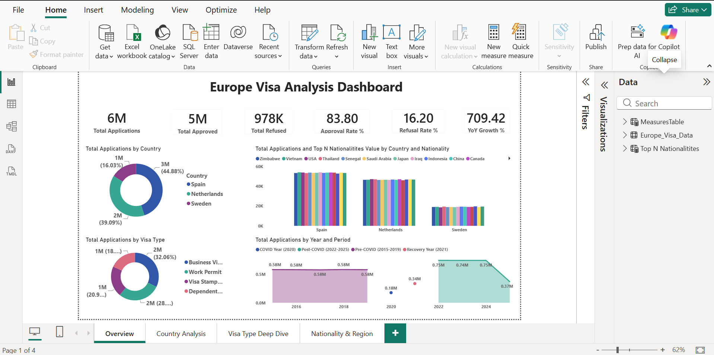
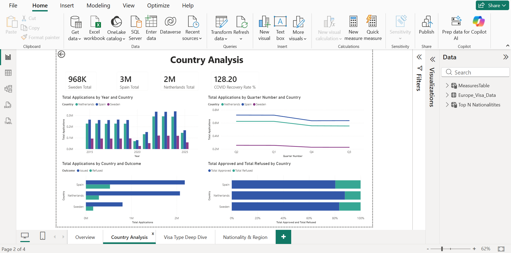
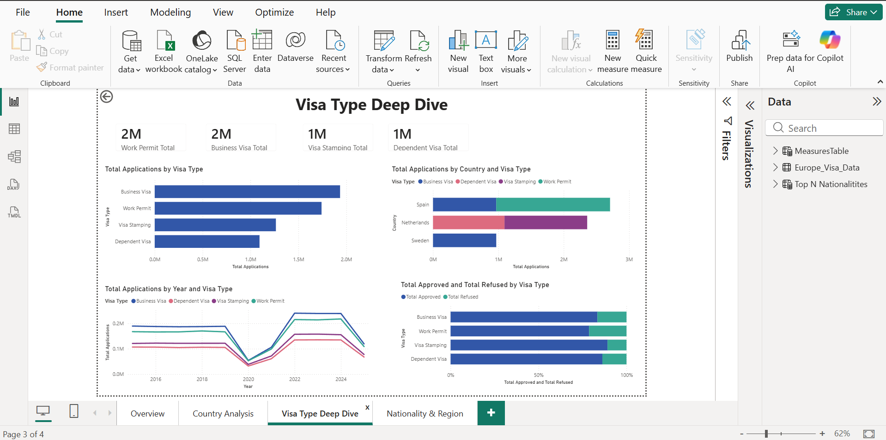
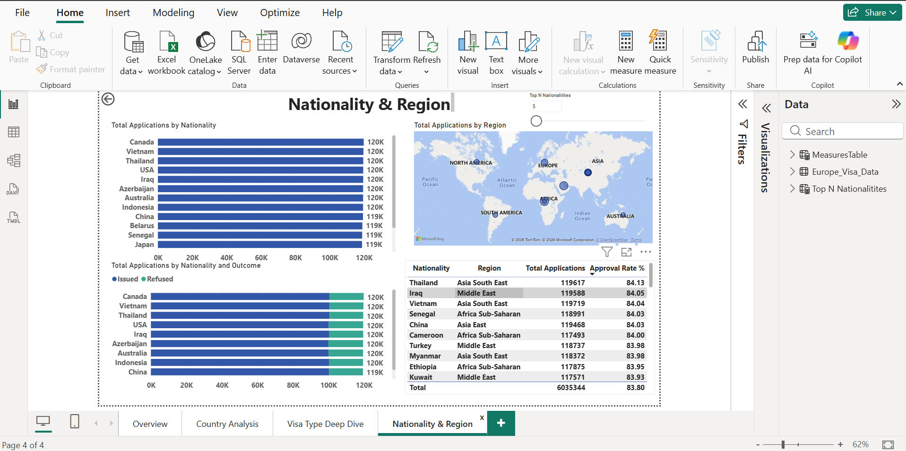

# Europe Visa Applications Dashboard

An end-to-end analytics project analyzing ~482,000 European visa application
records (2015–2024) across country, visa type, nationality, and region —
built in Power BI with a SQL data layer.

## Project Overview

This project explores visa application trends across Sweden, Spain, and the
Netherlands, examining approval/refusal patterns, COVID-era disruption and
recovery, and demand by nationality and visa category.

**Dataset:** 481,900 rows · 13 columns (Year, Country, Visa Type, Nationality,
Region, Outcome, Applications, Period, etc.)

## Dashboard Pages

1. **Overview** — headline KPIs (total applications, approval/refusal rate),
   applications by outcome and visa type, country comparison, time trend
2. **Country Analysis** — approval rates and application volume by country,
   year-over-year trends
3. **Visa Type Deep Dive** — breakdown by Work Permit, Business Visa, Visa
   Stamping, and Dependent Visa categories, including COVID-period impact
4. **Nationality & Region** — geographic distribution, top applicant
   nationalities, regional demand patterns

## Screenshots

**Overview**


**Country Analysis**


**Visa Type Deep Dive**


**Nationality & Region**


## Key Metrics (DAX / SQL)

| Metric | Logic |
|---|---|
| Total Applications | `SUM(Applications)` |
| Approval Rate % | Approved ÷ Total Applications × 100 |
| Refusal Rate % | Refused ÷ Total Applications × 100 |
| YoY Growth % | (Current Year − Prior Year) ÷ Prior Year × 100 |
| COVID Recovery Rate % | 2024 Applications ÷ 2019 Applications × 100 |

Full DAX-to-SQL translations are in [`sql/europe_visa_queries.sql`](sql/europe_visa_queries.sql).

## Tech Stack

- **Power BI** — report design, DAX measures, interactive visuals
- **SQL** — schema design, data validation, analytical queries (SQLite-compatible,
  portable to Postgres/MySQL/SQL Server)

## Repo Contents

```
├── Europe_Visa.pbix              # Power BI report file
├── sql/
│   └── europe_visa_queries.sql   # Schema, DAX-equivalent views, page-by-page queries
├── images/                       # Dashboard page screenshots
└── README.md
```

## How to Use

- **Power BI:** open `Europe_Visa.pbix` in Power BI Desktop
- **SQL:** run `sql/europe_visa_queries.sql` against a SQLite/Postgres/MySQL
  instance loaded with the same dataset to reproduce every metric in the report

## Sample Insights

- Overall approval rate across all countries and visa types: **83.8%**
- Applications had recovered to **128%** of pre-COVID (2019) volume by 2024
- Spain and the Netherlands account for the majority of application volume,
  with Sweden trailing significantly

